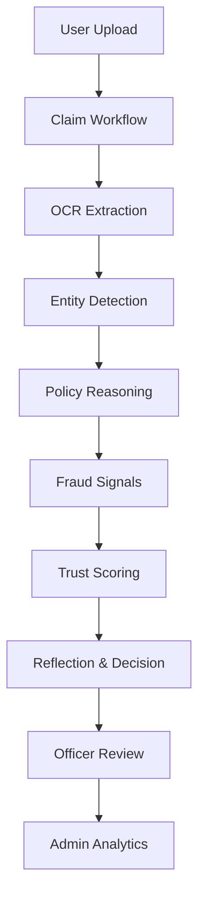

# 🏥 MediCurance - Enterprise Medical Claims Platform

[](https://github.com/yourusername/medicurance/actions)
[](https://www.python.org/downloads/)
[](https://flask.palletsprojects.com/)

**MediCurance** is a next-generation, AI-powered enterprise platform designed specifically for government healthcare reimbursement. Built to simplify, secure, and accelerate the medical claims lifecycle, it bridges the gap between beneficiaries, claims officers, and administrators through intelligent workflows and automated document processing.

This repository marks the completion of the project, combining a robust Flask backend with advanced AI reasoning, production-grade security, and a stunning, accessible enterprise UI.

---

## 🌟 Key Features

### 🧠 Agentic AI Workflow
- **Automated Document Processing:** Upload medical bills, discharge summaries, and prescriptions, which are automatically parsed via OCR.
- **Entity & Fraud Detection:** AI evaluates claims against government policies, flags inconsistencies, and calculates a dynamic Trust Score.
- **Contextual Retrieval (RAG):** AI uses a Vector DB to query official annexures, policies, and prior rulings to assist officers in decision-making.

### 🎙️ Multi-modal AI Chatbot
- **Integrated Voice Assistant:** Powered by Alchemyst AI and Gnani Speech services.
- **Multilingual Support:** Supports standard Indian English, Tamil, and other regional voices.
- **Seamless UX:** Context-aware conversations across the platform to assist beneficiaries in real-time.

### 🛡️ Production Hardened Security
- **Authentication:** Dual-layer login via Password and OTP (powered by Twilio).
- **Session Management:** Robust JWT ecosystem with short-lived access tokens, refresh token rotation, and cookie security (`HttpOnly`, `Secure`, `SameSite`).
- **Data Protection:** CSRF protection, comprehensive rate-limiting, secure headers, and automated account lockouts.

### 📊 Enterprise Dashboards
- **Beneficiary Portal:** Real-time timeline views of claim progress, profile management, and easy document uploads.
- **Claims Officer Workspace:** Prioritized queues, AI evidence panels, one-click claim assignments, and automated PDF letter generation (approvals/rejections).
- **Admin Command Center:** System-wide analytics, operational totals, health metrics, and fraud monitoring dashboards.

---

## 🏗️ Architecture Overview

The system is built on a modern microservices-inspired monolithic design:



### Core Technologies
- **Backend:** Flask, Python 3.10+
- **Database:** MongoDB (Metadata, Users, Claims), Redis (Caching)
- **Storage:** Supabase (Secure medical buckets)
- **AI/LLM:** Groq (Llama-3), Alchemyst AI (Agents), Gnani (TTS/STT), OCR.space
- **DevOps:** Docker, Docker Compose, Gunicorn, Nginx, GitHub Actions

---

## 🚀 Getting Started

### Local Development

1. **Clone the repository:**
   ```bash
   git clone https://github.com/yourusername/medicurance.git
   cd medicurance
   ```

2. **Install dependencies:**
   ```bash
   python -m venv venv
   source venv/bin/activate  # On Windows: venv\Scripts\activate
   pip install -r requirements.txt
   ```

3. **Configure Environment Variables:**
   Copy `.env.example` to `.env` and fill in your credentials:
   ```bash
   cp .env.example .env
   ```
   *Crucial variables include:* `SECRET_KEY`, `MONGO_URI`, `SUPABASE_URL`, `SUPABASE_SECRET_KEY`, `GROQ_API_KEY`, `ALCHEMYST_API_KEY`, `GNANI_API_KEY`, and `TWILIO_ACCOUNT_SID`.

4. **Run the Application:**
   ```bash
   python app.py
   ```
   *The app will be available at `http://localhost:5000`.*

### Containerized Deployment (Docker)

To run the full stack (including Redis, Nginx, and the Flask app) via Docker Compose:

```bash
docker compose up --build -d
```

---

## 📂 Project Structure

- `app.py`: Application entry point, configuring Flask, security headers, limits, and middleware.
- `blueprints/`: Route definitions (`user.py`, `officer.py`, `admin.py`, `auth.py`, `api.py`).
- `services/`: Core business logic (Claim processing, LLM generation, RAG, Alchemyst & Gnani wrappers, OTP).
- `database/`: Database repository pattern implementations.
- `templates/`: Jinja2 HTML templates featuring a modern, accessible UI.
- `static/`: CSS, JS, and image assets.
- `docs/`: Technical documentation, implementation reports, and deployment guides.
- `docker-compose.yml` / `Dockerfile`: Container configurations.

---

## 🧪 Testing

The repository includes a suite of security, authentication, and core workflow tests. To run them:

```bash
python -m unittest discover tests/
```

---

## 📚 API Documentation

MediCurance exposes a RESTful API for external integrations and system health monitoring. 
When the server is running, the interactive OpenAPI documentation is available at:

- **Swagger UI:** `/api/docs`
- **OpenAPI Schema:** `/api/openapi.json`

Key endpoints include:
- `GET /api/v1/health` - System health checks
- `GET /api/v1/metrics` - Performance metrics
- `GET /api/claims/<claim_id>/trace` - AI decision tracing

---

## 🏁 Conclusion

The MediCurance project successfully delivers a secure, intelligent, and user-centric platform for government healthcare reimbursement. From automated intelligent claim triage to enterprise-grade security and role-based dashboards, the platform is now fully feature-complete and production-ready.

---
*Developed with ❤️ for secure, accessible, and intelligent healthcare.*
