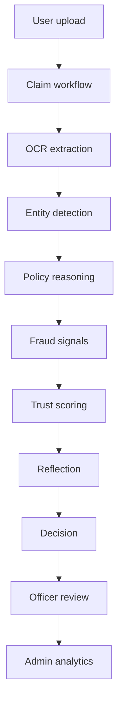

# MediCurance

MediCurance is an enterprise medical-claims platform for government healthcare reimbursement. The repository now combines:

- the original Flask application,
- the Phase 1 agentic AI workflow,
- the Phase 2 production hardening layer, and
- the Phase 3 enterprise UI and deployment stack.

The focus is to keep the system practical to run, secure enough for real workloads, and clear enough for reviewers and operators to understand at a glance.

## What’s Included

- Modern enterprise dashboards for users, officers, and admins
- Claim lifecycle views with AI context and timeline-oriented review
- Expanded admin analytics and system health surfaces
- JWT, refresh-token, revocation, and session hardening
- Caching hooks for hospitals, claims, and RAG retrieval
- API endpoints for health, metrics, traces, explanations, and docs
- Docker, Gunicorn, Nginx, and GitHub Actions CI support

## Architecture



## Key Areas

- `app.py` wires Flask, security headers, request IDs, rate limiting, and health reporting.
- `blueprints/` contains the user, officer, admin, auth, and API routes.
- `services/` contains claim processing, RAG, workflow, storage, and reporting helpers.
- `database/` contains repository and persistence helpers.
- `templates/` contains the enterprise UI.
- `static/` contains the new theme, scripts, and assets.
- `docs/` contains implementation notes and reports.

## UI Highlights

- User dashboard with claim overview, activity, and quick actions
- Claim submission flow with upload preview and live validation
- Claim status page with timeline-style history and AI evidence
- Officer workspace with queue prioritization and review context
- Admin command center with filters, charts, and operational totals
- AI intelligence panel with trend, risk, hospital, and reviewer views
- System health page for readiness checks

## Security And Runtime

Implemented protections include:

- secure password hashing
- account lockout after repeated failures
- JWT access and refresh tokens
- refresh-token rotation and revocation storage
- CSRF protection for form actions
- request-size limits
- upload validation
- rate limiting
- security headers
- request correlation IDs
- audit logging

## API Surface

Useful endpoints include:

- `GET /api/v1/health`
- `GET /api/v1/metrics`
- `GET /api/v1/status`
- `GET /api/v1/agents/status`
- `GET /api/claims/<claim_id>/trace`
- `GET /api/claims/<claim_id>/explanation`
- `GET /api/admin/stats`
- `GET /api/openapi.json`
- `GET /api/docs`

## Local Setup

1. Install dependencies:

```bash
pip install -r requirements.txt
```

2. Configure your environment variables in `.env`.

3. Run the app:

```bash
python app.py
```

## Container Deployment

Build and run with Docker:

```bash
docker compose up --build
```

Included deployment files:

- `Dockerfile`
- `docker-compose.yml`
- `gunicorn.conf.py`
- `nginx/nginx.conf`
- `.github/workflows/ci.yml`

## Environment Variables

Important variables include:

```env
SECRET_KEY=...
MONGO_URI=...
JWT_SECRET_KEY=...
JWT_ACCESS_EXP_MINUTES=15
JWT_REFRESH_EXP_DAYS=14
GROQ_API_KEY=...
GROQ_MODEL=...
SUPABASE_URL=...
SUPABASE_SECRET_KEY=...
OCR_SPACE_API_KEY=...
CORS_ALLOWED_ORIGINS=http://localhost:5000,http://127.0.0.1:5000
API_DOCS_ENABLED=true
```

## Testing

Run the current test suite with:

```bash
python -m unittest -q tests.test_phase2_security
```

## Documentation

- [docs/phase2_implementation_report.md](docs/phase2_implementation_report.md)
- [docs/phase3_implementation_report.md](docs/phase3_implementation_report.md)
- [docs/deployment.md](docs/deployment.md)

## Notes

- The UI has been redesigned for enterprise workflows, but the backend routes remain backward compatible.
- Deployment is container-ready, though real production secrets and infrastructure should still be supplied externally.
- Some AI and storage integrations are scaffolded around the existing environment variables and service hooks.
